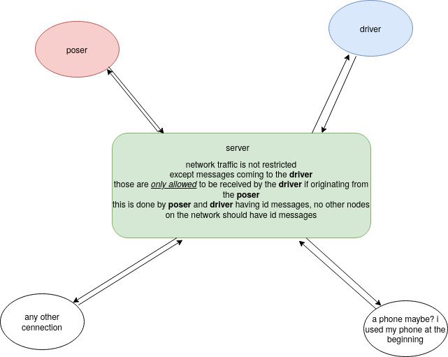
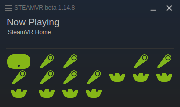

# Hobo VR

*a pc vr solution for hobos* don't ask why

Works with IMU and camera based homemade VR devices, 
or other devices if you provide the tracking.

&nbsp;

Steam View:

Debug view:

# Usage

 * From one terminal, run: `pyvr server`
     * This launches the server, which gathers information from trackers and passes that into steam. More info: [Server Documentation](https://github.com/okawo80085/hobo_vr/wiki/server)
 * Then, launch a tracker
     * Default tracker: `pyvr track`
         * This tracks bright spheres like in PSVR.
     * Implement and run a custom tracker. For example: `python -m examples.poserTemplate`
         * More info: [Poser Script Documentation](https://github.com/okawo80085/hobo_vr/wiki/poser-script)
 * Then, launch any steam VR game.
 
# Setup

1. [Steam](https://store.steampowered.com/about/) and [Python 3.7.x](https://www.python.org/downloads/release/python-378/) must already be installed.
2. In a terminal, run: `git clone https://github.com/okawo80085/hobo_vr`
3. Install the driver:
    * Windows:
        * double click the driver_register_win.bat file
    * Linux:
        * `cd ~/.local/share/Steam/steamapps/common/SteamVR/bin/linux64/`
        * `./vrpathreg adddriver "full/path/to/where/you/cloned/hobo_vr/hobovr"`
4. Install python repo: `pip-3.7 install -e .`

More info: [quick start guide](https://github.com/okawo80085/hobo_vr/wiki/quick-start-guide#initial-setup)

# Docs
[Quick Start and Driver Setup](https://github.com/okawo80085/hobo_vr/wiki/quick-start-guide)

[Server Documentation](https://github.com/okawo80085/hobo_vr/wiki/server)

[Udu Multiple Device Tracking](https://github.com/okawo80085/hobo_vr/wiki/udu)

[Compiling the Driver](driver/src/README.md)

Network Diagram:

# Development Requirements

C++: [openvr](https://github.com/ValveSoftware/openvr)

Python: No extra requirements.

# To Do

There's a lot still left to be done. Here are a few todo items:

Steamvr/Openvr:

1. Send frame textures over USB to a phone, using something like [rawdrawandroid](https://github.com/cnlohr/rawdrawandroid)
2. Send frames wirelessly, compression depending on bandwidth.

General software:

1. Replace OpenCV so we can open the same camera every time instead of a random one. (Windows only. Already done in Linux.)
2. Real time SLAM for inside out tracking without IR or other LEDs.
3. Stereo depth estimation so 3D models or menus can interact with the world and with games, and so lag is less disorienting.
4. Scan body once with webcam, or opportunistically, so we can use IMU-only tracking later.
5. VR pass through.
6. Camera based finger tracking. Necessary for sign language users.

Hardware:

1. Create default list of parts to buy for controllers and headset.
2. Create simple IMU-only trackers to be used with Udu.
3. Create 3D printable models for headset, controllers, and trackers.

Would be Awesome:

1. Speech recognition. Just go full Iron Man + Jarvis.
2. Windows / UI

## Bug Reporting / Contributions
*just do it*

# Fun / Extra

Custom Textures:

Lots of tracking:

